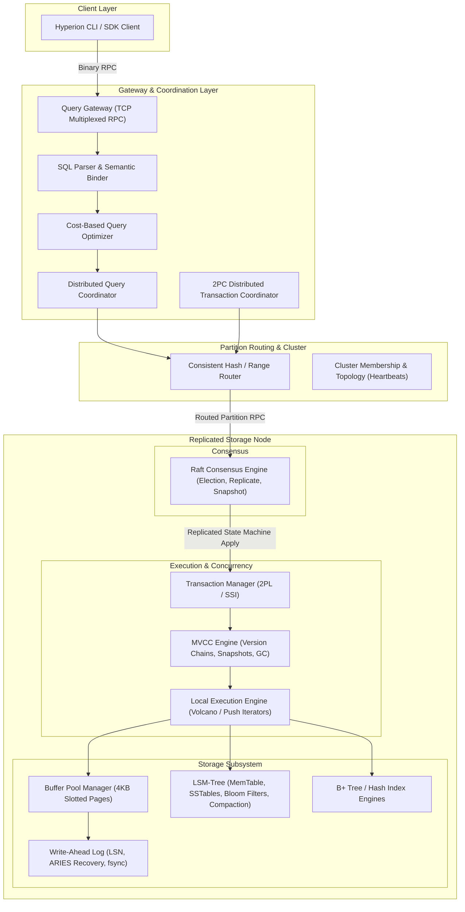

# Project Hyperion: Distributed Database Engine From First Principles

[]()
[](https://dotnet.microsoft.com/)
[](LICENSE)
[]()
[]()

> **"The database engine must be ours. No SQLite. No PostgreSQL. No RocksDB. No wrappers."**

---

## 1. Executive Summary

**Project Hyperion** is a production-grade, distributed, relational-capable database engine designed and implemented from first principles in C# and .NET 9. Every byte written to disk traverses an internal storage stack: slotted disk pages, Write-Ahead Logs (WAL) with strict physiological logging, Log Sequence Number (LSN) tracking, an in-memory buffer pool with clock-pro/LRU eviction, and an integrated Log-Structured Merge-Tree (LSM) engine for write-intensive key-value streams.

Above the physical storage layer, Hyperion implements:
1. **Multi-Version Concurrency Control (MVCC)** with epoch-based snapshots and lock-free/pessimistic hybrid concurrency control.
2. **ACID Transaction Manager** supporting `Read Committed`, `Repeatable Read`, and `Serializable` isolation levels with strict wait-for graph deadlock detection.
3. **Relational Query Pipeline** containing a Lexer, AST Parser, Semantic Analyzer/Binder, Catalog System, Cost-Based Optimizer, and Vectorized/Volcano Execution Engine.
4. **First-Principles Consensus (Raft)** supporting dynamic leader election, log replication, quorum commitments, snapshotting, and log truncation.
5. **Distributed Sharding & Routing** mapping logical tables to range/hash-partitioned Raft groups across multi-node topologies.
6. **Distributed Two-Phase Commit (2PC)** coordinating transactions spanning multiple independent Raft partitions with durable coordinator recovery logs.
7. **Deterministic Fault Injection & Verification Harness** allowing reproducible simulations of process crashes, network partitions, torn writes, bit rot, and clock skews.

---

## 2. High-Level Subsystem Topology



---

## 3. Core Engine Subsystems

### 3.1 Dual Storage Engine Architecture
Hyperion features a dual-engine storage architecture:
1. **Slotted Page B+ Tree Engine**:
   - Fixed 4096-byte pages aligned to OS virtual memory and SSD 4Kn physical sectors.
   - Slotted page architecture: Header at byte 0, slot array growing downward, tuples written from byte 4095 growing upward.
   - Hardware-accelerated CRC32C checksums computed via SSE4.2 / ARM intrinsics over all 4KB blocks.
   - In-memory Buffer Pool with Clock-Pro / 2Q page replacement and dirty frame writeback management.
2. **Log-Structured Merge-Tree (LSM) Engine**:
   - Concurrent SkipList `MemTable` for zero-allocation ingestion.
   - Immutable MemTables flushed as sorted, immutable `SSTables`.
   - 4KB Data Blocks with Block Indexes for binary search point lookups.
   - MurmurHash3 / XXHash64 **Bloom Filters** (10 bits/key, ~1% false positive rate) to eliminate disk I/O on negative lookups.
   - Pluggable compaction strategies: **Leveled Compaction (LCS)** and **Size-Tiered Compaction (STCS)**.
   - Atomic `Manifest` transaction log tracking version edits and SSTable generations.

### 3.2 Write-Ahead Logging (WAL) & ARIES Crash Recovery
- **The WAL Invariant**: No dirty page is ever written to disk until the WAL record describing that change has been durably synced to disk (`FlushedLSN >= PageLSN`).
- **Physiological Logging**: Compact representations recording physical page IDs with logical redo/undo operations.
- **Group Commit**: Concurrent transactions append to a lock-free ring buffer; a dedicated background flusher issues sequential writes and calls `FileStream.Flush(flushToDisk: true)` (`fsync`).
- **3-Phase ARIES Recovery**:
  1. *Analysis*: Scans forward from last checkpoint, reconstructing Active Transaction Table (ATT) and Dirty Page Table (DPT).
  2. *Redo*: Scans forward from minimum `RecLSN`, repeating history to restore exact pre-crash state.
  3. *Undo*: Scans backward through active transactions, undoing uncommitted writes and writing Compensation Log Records (CLRs).

### 3.3 Indexing Subsystem
- **Persistent B+ Tree**: High-fanout ordered index supporting logarithmic point lookups, updates, node splits, merges, and bidirectional range scans.
- **Extendible Hash Index**: $O(1)$ point lookups with dynamic bucket directory doubling without global rehashing.

### 3.4 Transactions & Multi-Version Concurrency Control (MVCC)
- **ACID Transaction Lifecycle**: `BEGIN`, `COMMIT`, `ROLLBACK`, savepoints, and timeout cancellations.
- **Granular Lock Manager**: Hierarchical Table, Page, and Row locks (`IS`, `IX`, `S`, `SIX`, `X`).
- **Deadlock Detection**: Background cycle detection using Tarjan's strongly connected components algorithm on the directed Wait-For Graph.
- **MVCC Snapshots**: Each version contains `Xmin` (creating TxId), `Xmax` (deleting TxId), and version chain pointers. Reads under Snapshot Isolation never acquire shared read locks and never block writers.
- **Isolation Levels**: `Read Committed`, `Repeatable Read` (Snapshot Isolation with first-committer-wins conflict detection), and `Serializable` (Serializable Snapshot Isolation with SIREAD dependency tracking).

### 3.5 Relational Query Processing & Optimization
- **Lexer & Parser**: Recursive descent parser supporting ANSI SQL DDL (`CREATE/DROP TABLE`, `CREATE/DROP INDEX`) and DML (`INSERT`, `UPDATE`, `DELETE`, `SELECT`, `WHERE`, `ORDER BY`, `LIMIT`, `OFFSET`, `GROUP BY`, `HAVING`, `JOIN`).
- **Semantic Binder & Catalog**: Resolves types, column references, table schemas, and permissions.
- **Rule-Based Optimizer (RBO)**: Heuristic rewrites including predicate pushdown, projection pruning, and constant folding.
- **Cost-Based Optimizer (CBO)**: Selectivity estimation based on column histograms, NDV (number of distinct values), and I/O cost models.
- **Volcano Iterator Execution**: Zero-allocation batch processing (`TupleBatch` of 1024 rows) implementing `SeqScan`, `IndexScan`, `Filter`, `Project`, `HashJoin`, `HashAggregate`, and `Sort`.

### 3.6 Raft Consensus Engine
- Native C# implementation of the Raft distributed consensus protocol (Ongaro & Ousterhout).
- Invariants: Election Safety, Leader Append-Only, Log Matching, Leader Completeness, State Machine Safety.
- Randomized election timeouts (150ms–300ms) with Pre-Vote phase to prevent disruption from partitioned nodes.
- Fast log conflict recovery via term-index backtracking in a single round-trip.
- State Machine Snapshotting (`InstallSnapshot`) and log truncation.
- Linearizable Reads via the **ReadIndex Protocol**.

### 3.7 Distributed Clustering, Partitioning & 2PC
- **Multi-Raft Architecture**: Physical nodes host multiple independent Raft consensus groups, scaling throughput horizontally.
- **Deterministic Partitioning**: Range Partitioning for ordered relational tables; Consistent Hashing (Murmur3 with 256 vnodes) for uniform load distribution.
- **Two-Phase Commit (2PC)**: Coordinates cross-partition atomic transactions with durable coordinator WAL logs, participant prepare states, and Presumed Abort optimization.
- **$\Phi$-Accrual Failure Detector**: Adaptive heartbeat suspicion calculation mitigating transient cloud network jitter.

---

## 4. Engineering Standards & Technology Stack

| Component | Standard / Technology | Justification |
|---|---|---|
| **Runtime** | .NET 9.0 (C# 13) | Native AOT capability, hardware intrinsics, high-performance runtime. |
| **Compiler Flags** | `<Nullable>enable</Nullable>`, `<TreatWarningsAsErrors>true</TreatWarningsAsErrors>` | Zero tolerance for null reference exceptions or unchecked compiler warnings. |
| **Hot Paths** | `ReadOnlySpan<byte>`, `Span<byte>`, `ref struct` | Zero allocations on the managed GC heap during query execution and page decoding. |
| **Buffer Management** | `ArrayPool<byte>.Shared`, `NativeMemory.AllocAligned(4096, 4096)` | Explicit memory reuse, aligned direct I/O buffers. |
| **Integrity** | CRC32C (Castagnoli) via `System.Runtime.Intrinsics.X86.Sse42.Crc32` | Over 20 GB/s per core checksum calculation. |
| **Concurrency** | `System.Threading.Channels.Channel<T>`, lock-free rings | Bounded backpressure, non-blocking asynchronous event loops. |

---

## 5. Repository Layout

```
project-hyperion/
├── src/
│   ├── Hyperion.Core/             # Primitives: PageId, Lsn, TxId, CRC32C, ByteSpan, Allocators
│   ├── Hyperion.Storage/          # 4KB Slotted Page, PageHeader, BufferPool, FileManager
│   ├── Hyperion.Wal/              # Physiological WAL, LogWriter, Group Commit, ARIES Recovery
│   ├── Hyperion.Lsm/              # MemTable, SSTables, Bloom Filter, Manifest, Compaction
│   ├── Hyperion.Index/            # Persistent B+ Tree and Extendible Hash Index
│   ├── Hyperion.Transactions/     # S2PL LockManager, Deadlock Detector, 2PC Coordinator
│   ├── Hyperion.Mvcc/             # Version Headers, Snapshot Visibility, Vacuum Cleaner
│   ├── Hyperion.Query/            # SQL Lexer, Parser, AST, Binder, Catalog, Volcano Executor
│   ├── Hyperion.Query.Optimizer/  # Rule-Based (RBO) and Cost-Based (CBO) Optimizer
│   ├── Hyperion.Network/          # Async Binary TCP Wire Protocol, Multiplexing, Framing
│   ├── Hyperion.Raft/             # Raft Consensus Engine, Election, Replicate, Snapshot
│   ├── Hyperion.Cluster/          # Membership, Topology, Heartbeats, Phi-Accrual Detector
│   ├── Hyperion.Distribution/     # Sharding, Range/Hash Routing, Distributed 2PC
│   ├── Hyperion.Observability/    # MetricsRegistry, Structured JSON Logger, Distributed Tracing
│   ├── Hyperion.Security/         # Authentication, Salted PBKDF2 Hashing, RBAC, Audit Log
│   ├── Hyperion.Server/           # Query Gateway, Background Node Daemons
│   ├── Hyperion.Client/           # Client SDK, Connection Pooling, Multiplexed Client
│   └── Hyperion.Cli/              # Interactive CLI & Administrative REPL
├── tests/
│   ├── Hyperion.Core.Tests/       # Unit tests for primitives, spans, and checksums
│   ├── Hyperion.Storage.Tests/    # Page layout, slot defragmentation, buffer pool tests
│   ├── Hyperion.Wal.Tests/        # WAL append, fsync, group commit, truncation tests
│   ├── Hyperion.Lsm.Tests/        # Memtable, SSTable blocks, Bloom filter, compaction tests
│   ├── Hyperion.Index.Tests/      # B+ tree splits, merges, scans, hash index tests
│   ├── Hyperion.Transaction.Tests/# Concurrency, lock conflicts, deadlock cycle detection
│   ├── Hyperion.Mvcc.Tests/       # Snapshot visibility, write skew, lost update tests
│   ├── Hyperion.Query.Tests/      # SQL parsing, AST validation, Volcano executor tests
│   ├── Hyperion.Raft.Tests/       # Election, log matching, partitioned leader tests
│   ├── Hyperion.Cluster.Tests/    # Sharding, routing table, rebalancing tests
│   ├── Hyperion.Recovery.Tests/   # ARIES crash-recovery, torn write, partial flush tests
│   ├── Hyperion.Chaos.Tests/      # Deterministic fault-injection scenarios
│   ├── Hyperion.PropertyTests/    # Randomized state-machine model comparison tests
│   └── Hyperion.ConsistencyTests/ # Jepsen-style linearizability and serializability tests
├── benchmarks/
│   └── Hyperion.Benchmarks/       # BenchmarkDotNet suites (Storage, WAL, LSM, Raft, SQL)
├── chaos/                         # Deterministic chaos experiments & scenarios
├── deploy/                        # Dockerfile, docker-compose.yml for local 3-node clusters
└── docs/                          # Comprehensive architectural specifications & ADRs
```

---

## 6. Architecture Decision Records (ADRs)

All major architectural decisions are formally documented under [`docs/adr/`](docs/adr/):

| ADR ID | Title | Summary |
|---|---|---|
| [ADR-0001](docs/adr/ADR-0001-hybrid-engine-slotted-pages-and-lsm.md) | Hybrid Storage Engine | Why both Slotted Disk Pages and LSM-Trees are implemented natively. |
| [ADR-0002](docs/adr/ADR-0002-wal-before-mutation-aries-recovery.md) | WAL and ARIES Recovery | Enforcing `FlushedLSN >= PageLSN` and 3-phase crash recovery. |
| [ADR-0003](docs/adr/ADR-0003-raft-consensus-engine.md) | Raft Consensus Engine | Why Raft was chosen over Multi-Paxos for state machine replication. |
| [ADR-0004](docs/adr/ADR-0004-mvcc-concurrency-and-snapshot-isolation.md) | MVCC & Snapshot Isolation | Timestamp-ordered version chains and non-blocking read snapshots. |
| [ADR-0005](docs/adr/ADR-0005-transaction-isolation-levels.md) | Transaction Isolation Levels | Guarantees against dirty reads, phantoms, lost updates, and write skew. |
| [ADR-0006](docs/adr/ADR-0006-custom-binary-serialization-framing.md) | Custom Binary Serialization | Zero-allocation binary framing format vs JSON/Protobuf. |
| [ADR-0007](docs/adr/ADR-0007-page-size-selection.md) | 4096-Byte Slotted Page Size | Alignment with OS virtual memory pages and 4Kn NVMe physical sectors. |
| [ADR-0008](docs/adr/ADR-0008-sstable-block-format-and-bloom-filter.md) | SSTable Format & Bloom Filters | 4KB data blocks, footer index, and Murmur3 Bloom filters. |
| [ADR-0009](docs/adr/ADR-0009-compaction-strategy.md) | LSM Compaction Strategies | Leveled Compaction (LCS) vs Size-Tiered Compaction (STCS). |
| [ADR-0010](docs/adr/ADR-0010-partitioning-consistent-hash-ranges.md) | Partitioning Strategy | Deterministic Range Boundaries vs MurmurHash3 Consistent Hash Ring. |
| [ADR-0011](docs/adr/ADR-0011-custom-tcp-rpc-protocol.md) | Custom Binary TCP Protocol | Multiplexed connections, correlation IDs, and bounded backpressure. |
| [ADR-0012](docs/adr/ADR-0012-phi-accrual-failure-detector.md) | $\Phi$-Accrual Failure Detection | Adaptive heartbeat suspicion calculation mitigating network jitter. |
| [ADR-0013](docs/adr/ADR-0013-crc32c-hardware-accelerated-checksum.md) | Hardware CRC32C Checksums | SSE4.2 hardware intrinsics for sub-microsecond data integrity verification. |
| [ADR-0014](docs/adr/ADR-0014-concurrency-memory-ownership.md) | Concurrency & Memory Ownership | Segregating CPU/IO, zero-alloc Spans, ArrayPool, and Channels. |

---

## 7. What I Learned

Building a distributed database engine from first principles exposes systems-engineering realities invisible in higher-level software development:

1. **Compaction is Not an Optimization; It Is an Invariant Engine**: In an LSM-tree, dropping a deleted key (tombstone) prematurely causes previously superseded older versions to resurrect ("ghost records"). Tombstones can only be safely collected when an SSTable is compacted into the deepest level containing that key.
2. **Crash Recovery Must Be Strictly Bounded**: In ARIES recovery, writing Compensation Log Records (CLRs) during the Undo phase is not optional. Without `UndoNextLSN` pointers in CLRs, a repeated crash during recovery can trigger an infinite undo cascade that leaves the database permanently unrecoverable.
3. **Async/Await in Hot Inner Loops Kills Storage Throughput**: While `async/await` is essential for network sockets and disk `fsync`, instantiating state machines and allocating tasks inside inner Volcano iterator loops or slot byte parsers degrades performance by orders of magnitude. Hot inner loops must operate synchronously over `ReadOnlySpan<byte>`.
4. **Quorums Only Protect What You Persist**: In Raft, accepting an entry into memory without forcing an `fsync` of the Raft log before responding to the leader turns a network partition into silent data divergence upon power failure. Durability and consensus cannot be separated.
5. **The Deceptiveness of Slotted Page Free Space**: Simple byte subtraction (`PageSize - UsedBytes`) does not represent usable free space in a slotted page. Record deletions and variable-length updates cause internal fragmentation. A page must track both contiguous free space and fragmented reclaimable space, triggering in-page defragmentation only when necessary.

---

## 8. Getting Started

### Prerequisites
- [.NET 9.0 SDK](https://dotnet.microsoft.com/download/dotnet/9.0) (or newer)
- Docker & Docker Compose (optional, for multi-node cluster deployment)

### Build Solution
```bash
git clone https://github.com/DamilolaAdegunwa/project-hyperion.git
cd project-hyperion
dotnet build -c Release
```

### Run Automated Test Suite
```bash
dotnet test -c Release --logger "console;verbosity=normal"
```

### Run Benchmarks
```bash
dotnet run -c Release --project benchmarks/Hyperion.Benchmarks
```

---

## 9. License
Project Hyperion is licensed under the MIT License. See [LICENSE](LICENSE) for details.
