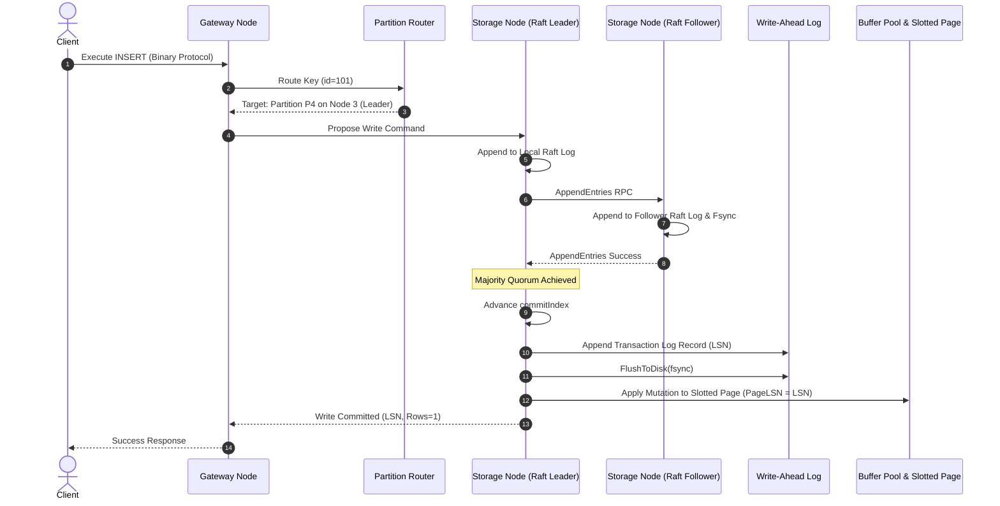
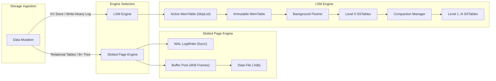

# Project Hyperion — System Architecture

## 1. End-to-End Request Lifecycle

Understanding how data flows through Hyperion is critical to understanding its engineering boundaries. Consider a distributed client executing an atomic write:

```sql
INSERT INTO accounts (id, balance) VALUES (101, 5000);
```

### Path of a Write Request:
1. **Transport Ingestion**: The client connects to a Hyperion Gateway node over TCP. The frame is decoded using a zero-allocation binary protocol decoder into an `RpcRequest`.
2. **Parsing & Binding**: The SQL is tokenized by `Hyperion.Query.Lexer`, parsed into an AST by `Hyperion.Query.Parser`, and resolved against the local catalog by `Hyperion.Query.Binder`.
3. **Partition Resolution**: The primary key `id = 101` is hashed or range-mapped against the cluster routing table (`Hyperion.Distribution.PartitionRouter`). The partition $P_4$ is identified, whose Raft leader currently resides on Node 3.
4. **Proxy or Dispatch**: If the current gateway is not Node 3, the request is forwarded via internal multiplexed RPC to Node 3's Raft engine.
5. **Raft Proposal**: Node 3's Raft leader receives the write command, creates a new log entry at current term $T_k$, appends it to its local Raft log, and broadcasts an `AppendEntriesRequest` to all followers in replica group $R_4$.
6. **Quorum Acknowledgment**: When a majority of followers acknowledge writing the log entry to their durable Raft logs, the leader advances its `commitIndex`.
7. **State Machine Execution (Apply)**:
   - The Raft engine delivers the committed command to the node's local execution engine.
   - The transaction manager acquires an exclusive row lock or verifies snapshot isolation validation.
   - A WAL log record (`LogRecordType.InsertRecord`) is constructed, assigned a monotonically increasing 64-bit `LSN`, and written to the Write-Ahead Log.
   - The slotted page buffer pool fetches the target data page (e.g. Page ID 42), writes the new record slot into the page, updates the page header's `PageLSN`, and marks the page as dirty.
8. **Client Response**: Once the WAL buffer has been flushed according to the requested durability policy (`WRITE_DURABLE`), the leader returns a success acknowledgment containing the committed LSN and affected row count to the Gateway, which sends the binary response to the client.



---

## 2. Layered Subsystem Architecture

Hyperion is organized into cleanly segregated decoupled layers. Dependencies flow strictly downwards:

```
[ Presentation Layer ]     -> Hyperion.Cli, Hyperion.Client
           |
[ Gateway & Transport ]    -> Hyperion.Server, Hyperion.Network
           |
[ SQL & Query Engine ]     -> Hyperion.Query, Hyperion.Query.Optimizer
           |
[ Distributed Consensus ]  -> Hyperion.Distribution, Hyperion.Cluster, Hyperion.Raft
           |
[ Transactions & MVCC ]    -> Hyperion.Transactions, Hyperion.Mvcc
           |
[ Storage & Indexing ]     -> Hyperion.Index, Hyperion.Lsm, Hyperion.Storage, Hyperion.Wal
           |
[ Foundation Infrastructure]-> Hyperion.Core, Hyperion.Observability, Hyperion.Security
```

### Layer Rules:
- **`Hyperion.Core`**: Zero external dependencies. Defines primitive types: `PageId`, `RecordId`, `Lsn`, `TransactionId`, `NodeId`, `PartitionId`, `Term`, `IndexId`, `ByteSpan`, memory pooling utilities, and CRC32C computation.
- **`Hyperion.Storage` & `Hyperion.Wal`**: Responsible solely for physical pages, record slots, buffer pool frame management, and sequential physiological write-ahead logging. Does not know about SQL or Raft.
- **`Hyperion.Lsm`**: Standalone Log-Structured Merge-Tree engine providing high-throughput append-only Key-Value persistence with MemTables, SSTable blocks, Bloom filters, and compaction strategies.
- **`Hyperion.Index`**: Implements B+ Trees and Extendible Hash Indexes over the Page/BufferPool abstractions.
- **`Hyperion.Transactions` & `Hyperion.Mvcc`**: Implements ACID transaction lifecycle, lock manager, deadlock cycle detection, and MVCC snapshot version records.
- **`Hyperion.Raft`**: Pure Raft consensus state machine. Receives commands via abstract log entries, manages elections, terms, and quorum replication. Completely decoupled from transport (uses abstract `IRaftTransport`).
- **`Hyperion.Distribution`**: Maps tables and primary keys to partitions, coordinates multi-partition Two-Phase Commit transactions, and maintains cluster topology.
- **`Hyperion.Query` & `Hyperion.Query.Optimizer`**: Translates SQL statements into optimized executable Volcano operator pipelines.
- **`Hyperion.Network`**: High-performance asynchronous binary frame socket server and client connection pool.
- **`Hyperion.Cli`**: System administrative interface and REPL for operators and developers.

---

## 3. Storage Hierarchy Comparison: Dual Engine Model

A major architectural innovation of Project Hyperion is the **Dual Storage Engine Model**:
1. **Slotted Page B+ Tree Engine**: Optimized for random transactional reads, in-place updates with MVCC version pointers, complex secondary indexing, and strict ARIES crash recovery.
2. **LSM-Tree Engine**: Optimized for write-heavy append-mostly workloads, time-series streams, and high-frequency key-value operations with leveled/size-tiered background compaction.



Both engines implement common transaction and checksum invariants, providing direct benchmark and architectural comparisons within the same codebase.
