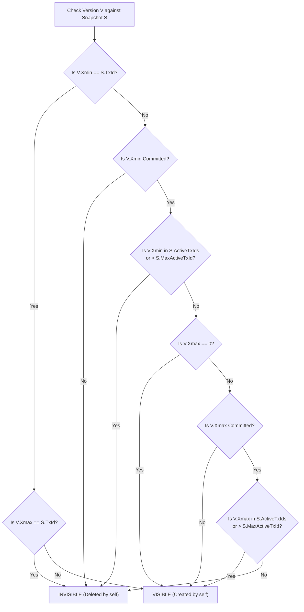

# Project Hyperion — Multi-Version Concurrency Control (MVCC)

## 1. Multi-Version Tuple Representation

In Hyperion, updates do not overwrite records in place destructively. Instead, an update creates a new version of the tuple and marks the previous version as superseded. This guarantees that long-running analytical queries (`SELECT`) can read consistent historical snapshots without acquiring shared locks that block concurrent writes (`UPDATE`, `DELETE`, `INSERT`).

### 1.1 Tuple Header Layout
Every tuple stored in a slotted page or LSM payload carries an MVCC header:

```
+-----------------------------------------------------------------------+
| MVCC TUPLE HEADER (24 bytes)                                          |
|  - Xmin                   : 8 bytes (TxId that created this version)  |
|  - Xmax                   : 8 bytes (TxId that deleted/superseded it) |
|  - NextVersionRecordId    : 6 bytes (PageId: 4B, Slot: 2B pointer)    |
|  - InfoMask               : 2 bytes (Committed, Aborted, Alive flags) |
+-----------------------------------------------------------------------+
| TUPLE USER DATA (Variable bytes)                                      |
|  - Column values (fixed and variable length)                          |
+-----------------------------------------------------------------------+
```

- When a record is **inserted** by transaction $T_1$:
  - $\text{Xmin} = T_1$, $\text{Xmax} = 0$ (alive).
- When a record is **updated** by transaction $T_2$:
  - The old version has its $\text{Xmax}$ set to $T_2$ and points its $\text{NextVersionRecordId}$ to the new version.
  - The new version is written with $\text{Xmin} = T_2$, $\text{Xmax} = 0$.
- When a record is **deleted** by transaction $T_3$:
  - $\text{Xmax}$ is set to $T_3$. No new version is created.

---

## 2. Snapshot Isolation & Visibility Algorithm

A transaction reading under Snapshot Isolation creates a `Snapshot` descriptor at its inception (or at statement start under Read Committed).

### 2.1 Snapshot Descriptor
```csharp
public sealed class TransactionSnapshot
{
    public ulong SnapshotTxId { get; }  // TxId of reading transaction
    public ulong MinActiveTxId { get; } // Lowest active TxId at snapshot creation
    public ulong MaxActiveTxId { get; } // Highest assigned TxId at snapshot creation
    public ImmutableHashSet<ulong> ActiveTxIds { get; } // Set of uncommitted transactions
}
```

### 2.2 Formal Visibility Rule
Given snapshot $S$ and tuple version $V$, the tuple is visible to $S$ if and only if:
1. **Creation Visibility**:
   - $V.\text{Xmin}$ is committed, **AND**
   - $V.\text{Xmin} < S.\text{MaxActiveTxId}$, **AND**
   - $V.\text{Xmin} \notin S.\text{ActiveTxIds}$, **OR**
   - $V.\text{Xmin} = S.\text{SnapshotTxId}$ (own mutations are always visible).
2. **Deletion Non-Visibility**:
   - $V.\text{Xmax} == 0$ (never deleted), **OR**
   - $V.\text{Xmax}$ aborted, **OR**
   - $V.\text{Xmax} > S.\text{MaxActiveTxId}$ (deleted after snapshot was taken), **OR**
   - $V.\text{Xmax} \in S.\text{ActiveTxIds}$ (deleted by a concurrent uncommitted transaction), **AND**
   - $V.\text{Xmax} \ne S.\text{SnapshotTxId}$ (own deletion makes it invisible).



---

## 3. Garbage Collection & Vacuuming

Old versions cannot accumulate indefinitely without degrading performance and exhausting disk space. Hyperion implements an **Epoch-based Asynchronous Vacuum Cleaner**:
1. The `TransactionManager` tracks the `GlobalMinActiveTxId` across all currently running transactions in the system.
2. Any tuple version where $\text{Xmax} \ne 0$, $\text{Xmax}$ is committed, and $\text{Xmax} < \text{GlobalMinActiveTxId}$ is dead to all current and future transactions.
3. The background Vacuum worker scans pages, unlinks dead versions from version chains, zeroes the corresponding page slots, and defragments the slotted page to reclaim contiguous free space.
