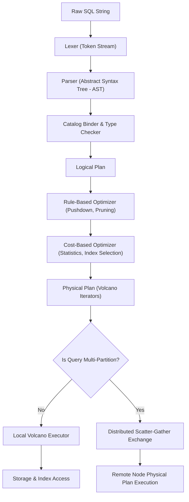

# Project Hyperion — Query Engine & Optimizer

## 1. Query Processing Pipeline

Hyperion implements a full relational query pipeline transforming raw SQL text into distributed execution plans:



---

## 2. SQL Dialect Support

Hyperion supports a rich relational DDL and DML subset:

- **DDL**: `CREATE TABLE`, `DROP TABLE`, `CREATE INDEX`, `DROP INDEX`.
- **DML**: `INSERT INTO`, `UPDATE`, `DELETE FROM`, `SELECT`.
- **Clauses**: `WHERE`, `ORDER BY (ASC|DESC)`, `LIMIT`, `OFFSET`, `GROUP BY`, `HAVING`.
- **Joins**: `INNER JOIN`, `LEFT JOIN` with arbitrary equality predicates.
- **Aggregates**: `COUNT()`, `SUM()`, `MIN()`, `MAX()`, `AVG()`.
- **Data Types**: `INT32`, `INT64`, `DOUBLE`, `VARCHAR`, `BOOLEAN`, `TIMESTAMP`.

---

## 3. Volcano Iterator Execution Model

Physical operators implement the classical iterator interface:

```csharp
public interface IPhysicalOperator : IAsyncDisposable
{
    ValueTask OpenAsync(ExecutionContext context, CancellationToken ct);
    ValueTask<TupleBatch?> NextAsync(CancellationToken ct);
    ValueTask CloseAsync();
}
```

To eliminate per-row virtual method call overhead and heap boxing, Hyperion processes tuples in **batches** (`TupleBatch` of 1024 rows) using column-oriented memory slices where possible, or compact row buffers.

### 3.1 Implemented Physical Operators
1. **`PhysicalSeqScan`**: Scans pages sequentially via Buffer Pool or SSTables under snapshot visibility.
2. **`PhysicalIndexScan`**: Traverses B+ Tree or Hash Index to retrieve matching `RecordId`s directly, avoiding full table scans for point and range queries.
3. **`PhysicalFilter`**: Evaluates Boolean expressions over input tuples, passing only matching rows.
4. **`PhysicalProject`**: Computes projection expressions, discarding unreferenced columns early.
5. **`PhysicalHashJoin`**: 
   - *Build Phase*: Reads inner relation into an in-memory hash table partitioned on join keys.
   - *Probe Phase*: Streams outer relation, probing the hash table to emit joined tuples.
6. **`PhysicalHashAggregate`**: Groups tuples using an in-memory accumulator table for `GROUP BY` aggregates.
7. **`PhysicalSort`**: External merge-sort using temporary files when result sets exceed buffer memory.
8. **`PhysicalLimit`**: Halts child operator iteration once `Offset + Limit` tuples are yielded.

---

## 4. Query Optimizer Architecture

The optimizer operates in two stages:

### 4.1 Rule-Based Transformations (Heuristics)
1. **Predicate Pushdown**: Pushes `WHERE` filter conditions as close to the leaf `Scan` operators as possible, minimizing the volume of data transferred through the pipeline.
2. **Projection Pruning**: Strips columns not referenced in parent operators, reducing memory bandwidth.
3. **Constant Folding**: Evaluates deterministic expressions at compile time (e.g. `WHERE age > 18 + 2` $\to$ `WHERE age > 20`).

### 4.2 Cost-Based Optimization (CBO)
The CBO uses table statistics to estimate operator cardinality and I/O cost:
- Table metadata tracks:
  - Total row count $N$.
  - Number of distinct values (NDV) per column.
  - Min/Max column bounds and equi-depth histograms.
- Selectivity estimation:
  $$\text{Selectivity}(col = val) = \frac{1}{\text{NDV}(col)}$$
  $$\text{Selectivity}(col > val) = \frac{\text{Max} - val}{\text{Max} - \text{Min}}$$
- Cost formulas:
  $$\text{Cost}(\text{SeqScan}) = \text{Pages} \times \text{Cost}_{\text{PageRead}} + \text{Tuples} \times \text{Cost}_{\text{CpuEval}}$$
  $$\text{Cost}(\text{IndexScan}) = \text{Height} \times \text{Cost}_{\text{PageRead}} + \text{EstimatedMatches} \times (\text{Cost}_{\text{PageRead}} + \text{Cost}_{\text{Cpu}})$$
- The optimizer enumerates alternative plans (e.g., `IndexScan` vs `SeqScan`, `HashJoin` vs `NestedLoopJoin`) and picks the minimum-cost tree.

---

## 5. Distributed Query Execution: Scatter-Gather & Partial Aggregation

When executing queries over sharded tables:
```sql
SELECT department_id, SUM(salary), COUNT(*) 
FROM employees 
GROUP BY department_id;
```

The distributed coordinator splits the plan into:
1. **Partition Leaf Plans**: Sent to each partition holding employee shards. Each partition locally filters and computes **Partial Aggregates**:
   - Emits `(department_id, partial_sum, partial_count)`.
2. **Coordinator Final Plan**: Gathers partial streams from all partitions via the network exchange, performs **Final Merge Aggregation**:
   - `Final SUM = SUM(partial_sum)`
   - `Final COUNT = SUM(partial_count)`
   - `Final AVG = SUM(partial_sum) / SUM(partial_count)`
3. Returns final joined tuples to the client without transferring raw base rows across the network.
