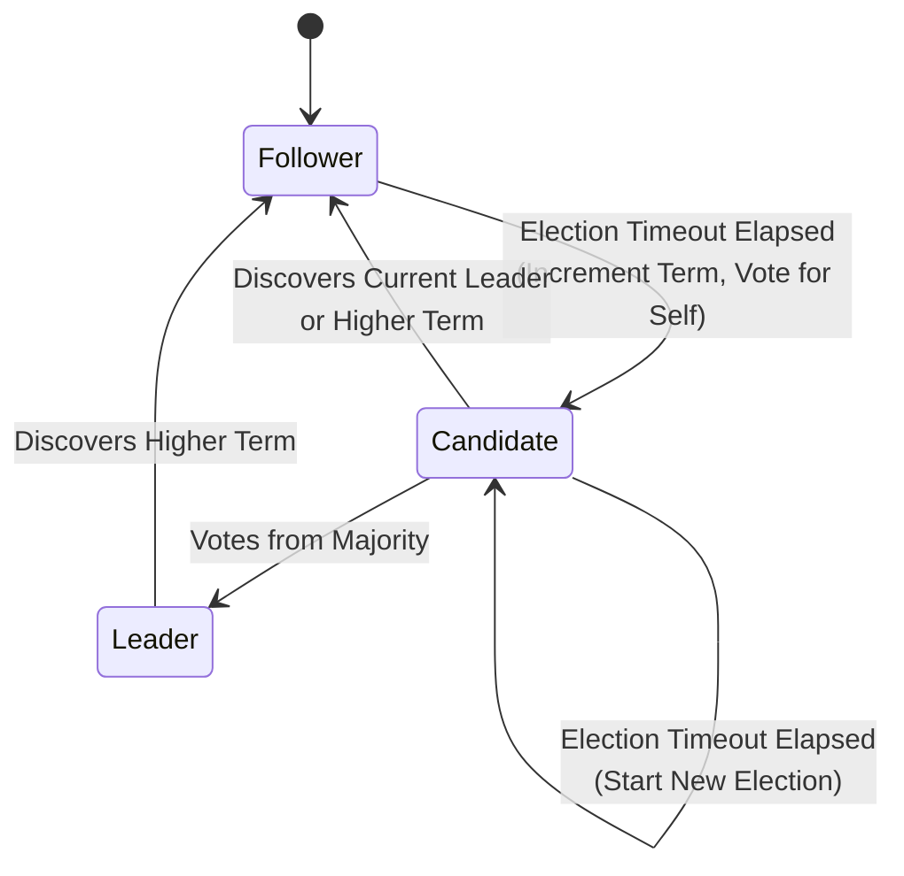

# Project Hyperion — Raft Consensus Engine

## 1. Raft Overview & Invariants

Hyperion implements the Raft consensus algorithm from first principles (Ongaro & Ousterhout, 2014) without third-party libraries. Raft guarantees linearizable consensus over an append-only replicated state machine log.

### 1.1 Five Non-Negotiable Raft Invariants

| Invariant | Description | Enforcement Mechanism |
|---|---|---|
| **Election Safety** | At most one leader can be elected in a given term. | A node may cast at most one vote per term (`votedFor` persisted to disk). A candidate must receive votes from a strict majority ($\lfloor N/2 \rfloor + 1$). |
| **Leader Append-Only** | A leader never overwrites or truncates its entries; it only appends new entries. | In code, `RaftLog.Append()` is the only mutation path exposed to the leader state machine. |
| **Log Matching** | If two logs contain an entry with the same index and term, then the logs are identical in all entries up through the given index. | Maintained by the inductive check in `AppendEntries`: the follower rejects the RPC if its log does not contain an entry at `prevLogIndex` matching `prevLogTerm`. |
| **Leader Completeness** | If a log entry is committed in a given term, that entry will be present in the logs of the leaders for all higher-numbered terms. | Candidate vote restriction: Voters reject `RequestVote` if the candidate's log is less up-to-date than their own (`candidate.lastLogTerm > voter.lastLogTerm` or equal terms and `candidate.lastLogIndex >= voter.lastLogIndex`). |
| **State Machine Safety** | If a server has applied a log entry at a given index to its state machine, no other server will ever apply a different log entry for the same index. | Follows from Leader Completeness and the commit index advancement rule (leaders only commit entries from their own term by counting replicas). |

---

## 2. Server States & State Transitions

At any time, each Raft node is in one of three states:



### 2.1 State Variables
```csharp
public class RaftState
{
    // Persistent on all servers (saved to disk before responding to RPCs)
    public ulong CurrentTerm { get; set; }
    public ulong? VotedFor { get; set; }
    public IRaftLog Log { get; set; }

    // Volatile state on all servers
    public ulong CommitIndex { get; set; }
    public ulong LastApplied { get; set; }

    // Volatile state on leaders (re-initialized after election)
    public Dictionary<ulong, ulong> NextIndex { get; set; }  // NodeId -> next log index to send
    public Dictionary<ulong, ulong> MatchIndex { get; set; } // NodeId -> highest known replicated index
}
```

---

## 3. Remote Procedure Calls (RPCs)

### 3.1 RequestVote RPC
Invoked by candidates to gather votes:
- **Arguments**: `Term`, `CandidateId`, `LastLogIndex`, `LastLogTerm`.
- **Results**: `Term`, `VoteGranted`.
- **Receiver Implementation**:
  1. Reply `false` if `Term < currentTerm`.
  2. If `votedFor` is null or `CandidateId`, and candidate's log is at least as up-to-date as receiver's log, grant vote.

### 3.2 AppendEntries RPC
Invoked by leader to replicate log entries and serve as heartbeats:
- **Arguments**: `Term`, `LeaderId`, `PrevLogIndex`, `PrevLogTerm`, `Entries[]`, `LeaderCommit`.
- **Results**: `Term`, `Success`, `MatchIndex`.
- **Receiver Implementation**:
  1. Reply `false` if `Term < currentTerm`.
  2. Reply `false` if log doesn't contain an entry at `PrevLogIndex` matching `PrevLogTerm`.
  3. If an existing entry conflicts with a new one (same index, different terms), delete the existing entry and all that follow it.
  4. Append any new entries not already in the log.
  5. If `LeaderCommit > commitIndex`, set `commitIndex = min(LeaderCommit, index of last new entry)`.

### 3.3 Fast Conflict Recovery
When a follower rejects `AppendEntries`, naive Raft steps back `nextIndex` one-by-one, which takes $O(K)$ round-trips for $K$ unaligned entries. Hyperion implements **fast log backtracking**:
- The follower returns `ConflictTerm` and `ConflictIndex` (the first index of the conflicting term in its log).
- The leader immediately jumps `nextIndex` back to `ConflictIndex`, resolving differences in a single round-trip.

---

## 4. Snapshotting and Log Compaction

As the log grows indefinitely, memory and disk space would be exhausted, and restart replay time would become unbounded.
- When `Log.Count` exceeds a configured threshold, the state machine generates a compact snapshot.
- The snapshot records:
  - `LastIncludedIndex`: The highest log index incorporated into the snapshot.
  - `LastIncludedTerm`: The term of that entry.
  - `StateData`: The serialized state machine (e.g. SSTable root or page data dump).
- All log entries up to `LastIncludedIndex` are discarded from the Raft log.
- If a follower is so far behind that its `nextIndex` has been discarded by the leader, the leader sends `InstallSnapshot` RPC to bring the follower up to date in bulk.

---

## 5. Linearizable Read Protocol

Hyperion prevents stale reads caused by partitioned leaders through the **ReadIndex Protocol**:
1. When a read request arrives at the leader, the leader records its current `commitIndex` as `ReadIndex`.
2. The leader broadcasts a heartbeat (`AppendEntries` with empty payload) to all peers to confirm it is still the legitimate majority leader.
3. Once a majority responds affirmatively, the leader waits until its `lastApplied >= ReadIndex`.
4. The leader executes the read against its local state machine and returns the result, guaranteeing strong linearizability without writing read-operations into the durable Raft log.
