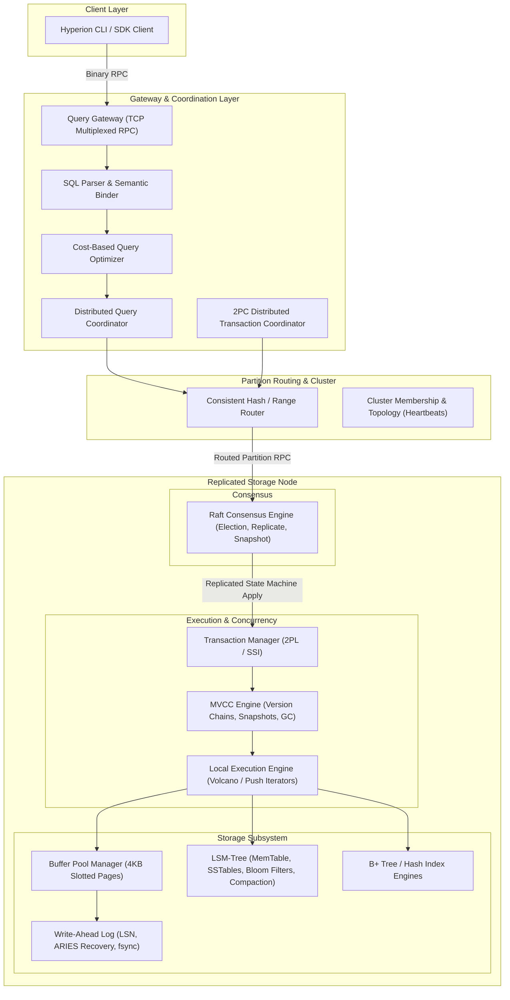

# Project Hyperion — System Overview

## 1. Executive Summary

**Project Hyperion** is a production-grade, distributed, relational-capable database engine designed and implemented from first principles in C# and .NET 9. Hyperion does not wrap SQLite, PostgreSQL, RocksDB, or BerkeleyDB. Every byte written to disk traverses an internal storage stack: slotted disk pages, Write-Ahead Logs (WAL) with strict Physiological logging, Log Sequence Number (LSN) tracking, an in-memory buffer pool with clock-pro/LRU eviction, and an integrated Log-Structured Merge-Tree (LSM) engine for write-intensive key-value streams. 

Above the storage engine, Hyperion implements:
1. **Multi-Version Concurrency Control (MVCC)** with epoch-based snapshots and lock-free/pessimistic hybrid concurrency control.
2. **ACID Transaction Manager** supporting `Read Committed`, `Repeatable Read`, and `Serializable` isolation levels with strict deadlock detection.
3. **Relational Query Pipeline** containing a Lexer, AST Parser, Semantic Analyzer/Binder, Catalog System, Cost-Based Optimizer, and Vectorized/Volcano Execution Engine.
4. **First-Principles Consensus (Raft)** supporting dynamic leader election, log replication, quorum commitments, snapshotting, and log truncation.
5. **Distributed Sharding & Routing** mapping logical tables to range/hash-partitioned Raft groups across multi-node topologies.
6. **Distributed Two-Phase Commit (2PC)** coordinating transactions spanning multiple independent Raft partitions with durable coordinator recovery logs.
7. **Deterministic Fault Injection & Verification Harness** allowing reproducible simulations of process crashes, network partitions, torn writes, bit rot, and clock skews.

---

## 2. Core Architectural Philosophy

Hyperion adheres to six non-negotiable systems-engineering principles:

```
                        Correctness
                             >
                       Observability
                             >
                        Testability
                             >
                        Performance
                             >
                    Micro-optimization
```

1. **Mechanical Sympathy**: Memory layouts, page headers, disk alignment (4096-byte boundaries), cache-line efficiency (64 bytes), and zero-allocation spans (`ReadOnlySpan<byte>`, `Memory<byte>`, `ArrayPool<byte>`) drive data movement.
2. **Explicit Durability Boundaries**: A write is never reported as committed until its corresponding WAL entry has traversed OS page cache boundaries and executed hardware-level flush (`fsync` / `FlushToDisk(true)`).
3. **No Hidden State**: All subsystem states (buffer pool cache hit/miss, WAL flushes, Raft terms, lock graphs, MVCC version counts) are directly measurable via metric registries and structured traces.
4. **Deterministic Reproducibility**: Any failure discovered in consensus, recovery, or transaction scheduling must be captureable into a reproducible seed scenario for automated regression testing.
5. **Fail-Stop and Fast Recovery**: If a page corruption, checksum mismatch, or invariant violation occurs, Hyperion refuses to propagate corrupt state, initiates immediate fail-stop, and triggers deterministic WAL recovery upon restart.
6. **Zero External Persistence Dependencies**: Hyperion contains zero database dependencies. Serialization, storage, replication, indexing, and transactions are 100% native.

---

## 3. High-Level Subsystem Topology



---

## 4. Subsystem Responsibilities

| Subsystem | Responsibility | Invariant |
|---|---|---|
| **Storage Engine (`Hyperion.Storage`)** | Manages physical page layouts on block devices, slotted-page records, free-space maps, buffer pool caching, dirty page writeback, and disk serialization. | No dirty page is flushed to disk before the WAL record covering its update has been flushed (`WAL Flush LSN >= Page LSN`). |
| **Write-Ahead Log (`Hyperion.Wal`)** | Sequential append-only logging of physiological operations with 64-bit monotonically increasing Log Sequence Numbers (LSNs), group commit, and ARIES-style recovery (Analysis, Redo, Undo). | A committed transaction's WAL records must be durably synced to disk before commit returns to client. |
| **LSM Engine (`Hyperion.Lsm`)** | High-throughput key-value storage engine using SkipList MemTables, Immutable MemTables, multi-level SSTables, block indexes, Bloom filters, and concurrent compaction. | Keys in SSTables are sorted; SSTables in Level 1+ have mutually disjoint key ranges. |
| **Indexing (`Hyperion.Index`)** | Order-preserving persistent B+ Tree and fast O(1) Hash Index implementations over the buffer pool. | B+ Tree invariant: internal nodes have between $\lceil M/2 \rceil$ and $M$ children; leaf nodes maintain ordered keys and doubly-linked sibling pointers. |
| **Transactions (`Hyperion.Transactions`)** | Transaction lifecycle (`BEGIN`, `COMMIT`, `ROLLBACK`), Strict 2-Phase Locking (S2PL), wait-for graph deadlock detection, and snapshot isolation. | Atomicity & Isolation: Either all operations in a transaction take effect, or none do; transactions do not read uncommitted writes. |
| **MVCC (`Hyperion.Mvcc`)** | Version records with transaction timestamps (`xmin`, `xmax`), active snapshot isolation descriptors, version chain traversal, and background epoch garbage collection. | Visibility invariant: A transaction $T$ at snapshot $S$ sees version $V$ iff $V.xmin \le S.SnapshotTxId$ and $V.xmin \notin S.ActiveTxIds$ and ($V.xmax = 0$ or $V.xmax > S.SnapshotTxId$ or $V.xmax \in S.ActiveTxIds$). |
| **Query Engine (`Hyperion.Query`)** | SQL Lexing, parsing into AST, catalog validation, logical plan construction, Volcano iterator physical execution (`TableScan`, `IndexScan`, `Filter`, `Project`, `HashJoin`, `Aggregate`). | Purity & Typestate: Queries execute within the declared snapshot isolation context without leaking state between concurrent workers. |
| **Query Optimizer (`Hyperion.Query.Optimizer`)** | Rule-based rewrites (constant folding, predicate pushdown, projection pruning) and cost-based plan generation using table statistics (cardinality, histogram buckets). | Equivalence invariant: Transformed logical plan produces identical tuples to initial parsed tree for any valid dataset. |
| **Networking (`Hyperion.Network`)** | High-performance asynchronous binary framing protocol, multiplexed channels, keep-alive heartbeats, backpressure flow control, and connection pooling. | Idempotency invariant: Retried requests contain unique Request IDs to prevent duplicate execution during network partitions. |
| **Raft Consensus (`Hyperion.Raft`)** | Leader election, log replication, quorum matching, log truncation, commit advancement, and state machine snapshotting. | Election Safety, Leader Append-Only, Log Matching, Leader Completeness, State Machine Safety (Ongaro & Ousterhout). |
| **Distributed Cluster (`Hyperion.Cluster` & `Distribution`)** | Partition routing table, shard assignment, range boundaries, replica group management, and cross-partition Two-Phase Commit coordinator. | Partition uniqueness: Exactly one primary Raft group owns any given primary key range at any term. |

---

## 5. Technology Stack & Runtime Standards

- **Language & Runtime**: C# 13 / .NET 9.0 (with C# latest compiler features: collection expressions, ref structs, native integer arithmetic).
- **Compilation Targets**: `net9.0`, Nullable Reference Types enabled (`<Nullable>enable</Nullable>`), Warnings as Errors (`<TreatWarningsAsErrors>true</TreatWarningsAsErrors>`).
- **Memory Safety & Allocations**:
  - Zero-allocation inner loops: `ReadOnlySpan<byte>`, `Span<byte>`, `MemoryPool<byte>.Shared`, `ArrayPool<byte>.Shared`.
  - Fixed-layout unmanaged structs with `[StructLayout(LayoutKind.Sequential, Pack = 1)]` for on-disk headers.
  - Struct enumerators and value task pipelines where applicable to prevent heap allocations on hot paths.
- **Hardware Acceleration**:
  - CRC32C using `System.Runtime.Intrinsics.X86.Sse42.Crc32` with managed fallback for non-x86 platforms.
  - Bit manipulation intrinsics (`BitOperations.LeadingZeroCount`, `PopCount`).
