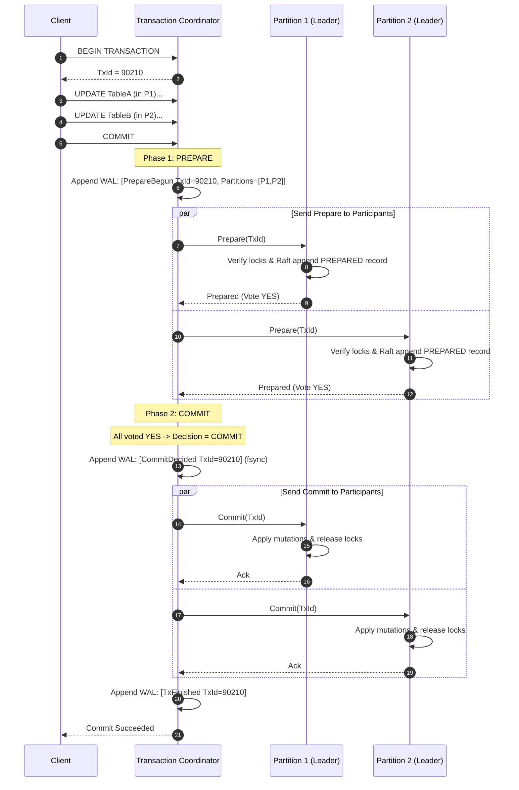

# Project Hyperion — Transaction Engine & Distributed 2PC

## 1. ACID Guarantees in Hyperion

Project Hyperion guarantees classical ACID properties both locally within a single partition and globally across distributed partitions:

- **Atomicity**: An execution of multiple statements across arbitrary partitions either commits entirely or leaves no trace on any replica. Handled via WAL rollback locally and Two-Phase Commit (2PC) globally.
- **Consistency**: Relational constraints, primary key uniqueness, foreign key validity, and schema invariants are preserved at commit time.
- **Isolation**: Concurrent transactions execute without destructive interference according to the selected isolation level (`Read Committed`, `Repeatable Read`, `Serializable`).
- **Durability**: Once a transaction receives a successful commit acknowledgment, its state will survive arbitrary single-node, cluster-wide, or power-failure crashes.

---

## 2. Local Concurrency Control & Lock Manager

Hyperion implements a dual-mode concurrency architecture:
1. **Multi-Version Snapshot Isolation (MVCC)** for read operations (reads never block writes, writes never block reads).
2. **Strict Two-Phase Locking (S2PL)** and Serializable Snapshot Isolation (SSI) for write-write conflict resolution.

### 2.1 Granular Lock Hierarchy
To minimize contention, locks are granted at three granular levels:
- **Table Lock**: Intention Shared (`IS`), Intention Exclusive (`IX`), Shared (`S`), Exclusive (`X`).
- **Page Lock**: For physical structural changes (e.g. B+ Tree splits or slotted page defragmentation).
- **Row Lock**: Key-level `Shared` or `Exclusive` locks protecting individual `RecordId`s.

```
Lock Compatibility Matrix:
        IS      IX      S       SIX     X
IS      OK      OK      OK      OK      NO
IX      OK      OK      NO      NO      NO
S       OK      NO      OK      NO      NO
SIX     OK      NO      NO      NO      NO
X       NO      NO      NO      NO      NO
```

### 2.2 Deadlock Detection
Under high concurrency with lock acquisition across multiple rows, deadlocks can occur ($T_1 \to \text{waits for } T_2 \to \text{waits for } T_1$).
- Hyperion's `LockManager` maintains an internal directed **Wait-For Graph** ($V = \{\text{Transactions}\}, E = \{(T_i, T_j) \mid T_i \text{ is waiting for a lock held by } T_j\}$).
- A background worker runs every 50ms executing **Tarjan's strongly connected components algorithm** or depth-first cycle search.
- When a cycle is detected, the transaction with the latest start time (youngest) or least accumulated work is chosen as the victim, and is aborted with a `DeadlockException`, freeing its locks.

---

## 3. Distributed Transactions: Two-Phase Commit (2PC)

When a transaction mutates data that spans multiple independent Raft partitions, single-partition consensus is insufficient. Hyperion employs a durable **Two-Phase Commit (2PC)** protocol with the **Presumed Abort** optimization.



### 3.1 Failure Modes and Recovery in 2PC

| Failure Scenario | Recovery Mechanism |
|---|---|
| **Participant crashes before Prepare** | Coordinator times out, logs `AbortDecided`, and sends `Abort` to all participants. |
| **Participant votes NO** | Coordinator logs `AbortDecided`, sends `Abort` to all participants who voted YES, and notifies client. |
| **Participant crashes after voting YES (Prepared)** | The participant's `PREPARED` state is durable in its local Raft log. On restart, it remains in the in-doubt state holding locks until it contacts the coordinator or recovers the decision. |
| **Coordinator crashes after logging `CommitDecided`** | On coordinator restart, recovery scans the coordinator WAL. Finding `CommitDecided` without `TxFinished`, the coordinator resends `Commit` to all participants until acknowledged. |
| **Coordinator crashes before logging `CommitDecided`** | Presumed Abort: Any participant in doubt that queries the coordinator for an unknown transaction is told to `Abort`. |

---

## 4. Transaction Isolation Guarantees

| Anomaly | Read Committed | Repeatable Read | Serializable (SSI) |
|---|---|---|---|
| **Dirty Read** | Prevented | Prevented | Prevented |
| **Non-Repeatable Read** | Possible | Prevented | Prevented |
| **Phantom Read** | Possible | Prevented (via MVCC snapshot) | Prevented |
| **Lost Update** | Possible | Prevented (First-Committer-Wins) | Prevented |
| **Write Skew** | Possible | Possible | Prevented (SIREAD lock tracking) |
